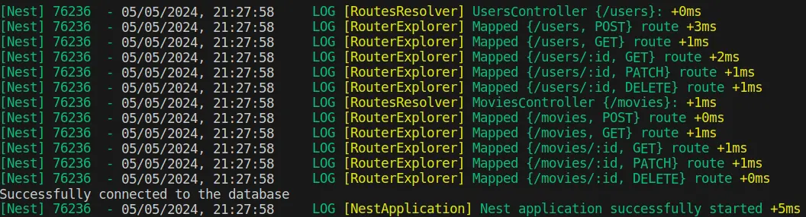

# Movie Catalog

> 🌐 https://gargani-dev-movie-catalog.onrender.com/api

> ⭐️ Projeto desenvolvido para o [MKS Back-end Challenge](https://github.com/MKS-desenvolvimento-de-sistemas/mks-backend-challenge)

# Diretrizes do desafio

Por favor organize, design, teste, faça a documentação e deploy do seu código da forma como se ele fosse para produção, depois nos envie um link do repositório no Github.

## Tarefa (funcional)

1. Desenvolva um sistema de autenticação JWT.
2. Você deve construir uma CRUD de um catálogo de filmes. Todos os endpoints dessa CRUD só devem ser consumidos por um usuário autenticado.

## Ferramentas requeridas/ Tempo de Experiência

1. TypeScript / 2 Anos
2. Nest.js / Experiência prévia com Express (2 anos)
3. TypeORM / Experiência prévia com Sequelize (1 ano)
4. Swagger / Sem experiência prévia
5. Docker / 1 Ano
6. Redis / Sem experiência prévia
7. PostgreSQL / Experiência prévia com MySQL (1~2 anos)

## Aspectos técnicos

A arquitetura deve ser composta de uma aplicação provendo uma API RESTful em JSON, utilize do Redis como seu cache.

OBS: Lembre-se de validar a informação tratada em cada endpoint.

## Deploy

[Render (Individual)](https://render.com/about) (há um _delay_ de inicialização no _free-tier_)

> 🌐 https://gargani-dev-movie-catalog.onrender.com/api
